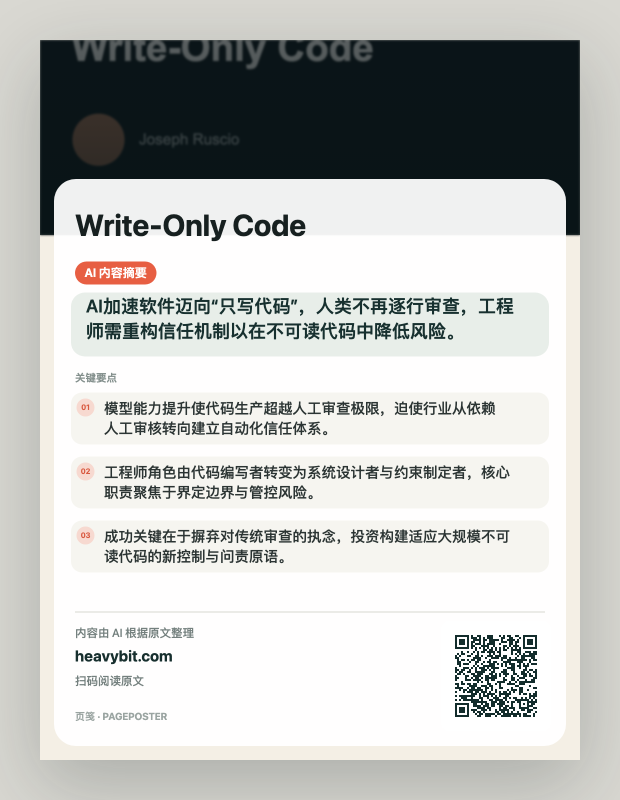

# PagePoster（海报机）

把当前公开文章一键转换成带中文 AI 摘要、来源域名和二维码的 3:4 分享海报。



## 当前 MVP

- Manifest V3，面向 macOS / Windows 11 的 Chrome 桌面版。
- 打开 Popup 后由用户主动点击“生成海报”才提取公开文章；同一标签页和 URL 不会重复调用 AI。
- 标题保留原文，只清理可识别的网站后缀。
- 摘要统一输出简体中文：一个核心观点和 2～3 个要点。
- 内置瑞士编辑、夜间信号、拼贴杂志和东方编辑四套 Canvas 海报风格，默认使用瑞士编辑。
- 海报风格保存在本机设置中；切换风格只会重新排版已有摘要，不会重复调用 AI。
- 生成 1080 × 1440 PNG，二维码会从最终画布中重新解码校验。
- 优先复制 PNG 到剪贴板；只有复制失败时才显示下载按钮。
- “换一版”重新生成摘要；关闭弹窗不终止后台任务。
- API Key 通过 WXT 的 `browser.storage.local` 保存在本机，不会通过 Chrome 同步。
- 设置页支持导入、导出完整配置；导出的 JSON 包含明文 API Key，仅用于可信设备间迁移。
- 文章、摘要和结果保存在 `browser.storage.session`，浏览器重启后清除。

## 本地安装

要求 Node.js 20+ 和当前版本 Chrome。

```bash
corepack pnpm install
corepack pnpm check
```

然后：

1. 打开 `chrome://extensions`。
2. 开启右上角“开发者模式”。
3. 点击“加载已解压的扩展程序”。
4. 选择本项目的 `.output/chrome-mv3` 目录。
5. 打开扩展设置，填写 HTTPS API 地址和 API Key，获取并选择模型，选择海报风格后测试连接。

开发时可运行：

```bash
corepack pnpm dev
```

WXT 会启动带有开发版扩展的 Chrome，并在源文件变化后自动刷新对应入口。

生成正式构建和 Chrome Web Store 发布包：

```bash
corepack pnpm build
corepack pnpm zip
```

正式扩展输出到 `.output/chrome-mv3`，ZIP 输出到 `.output/PagePoster-v0.1.0-chrome.zip`。

项目不再直接依赖或调用 esbuild；开发、构建、打包和 Manifest 生成均由 WXT CLI 负责。`pnpm-lock.yaml` 中仍可能出现 esbuild，因为它是 WXT/Vite/Vitest 的间接底层依赖，不代表项目还保留了旧的 esbuild 构建脚本。

## 发布

项目使用 `release-it` 统一维护版本号、`CHANGELOG.md`、Git tag、GitHub Release 和 WXT ZIP 附件。发布前至少运行：

```bash
corepack pnpm release:check <version>
corepack pnpm verify
corepack pnpm zip
corepack pnpm release:check --check-zip
```

完整流程、首次发布和发布后核对方式见 [RELEASE.md](RELEASE.md)。

## AI 接口约定

第一版使用最小 OpenAI 兼容集：

- `POST {API Base URL}/chat/completions`
- Bearer API Key
- 单次非流式请求
- `response_format: { "type": "json_object" }`
- `choices[0].message.content` 返回以下 JSON：

```json
{
  "thesis": "核心观点",
  "points": ["要点一", "要点二", "要点三"]
}
```

如果 HTTPS API 地址已经以 `/chat/completions` 结尾，扩展不会再次追加路径。保存设置时，Chrome 只请求该 API origin 的运行时权限；扩展不会申请长期读取所有网页的权限。

## 数据边界

只有用户在 Popup 中点击“生成海报”后，扩展才会读取当前标签页。发送给模型的内容包括：

- 原始标题和网页描述
- 可提取的章节标题
- 正文开头约 9,000 字符
- 正文结尾约 9,000 字符

不会发送 Cookie、浏览历史或完整 HTML。本机地址、局域网、内网域名、PDF、非 HTTP(S) 页面会被拒绝处理。

## 项目结构

```text
src/entrypoints  WXT 扩展入口与按需注入脚本
src/background   后台任务、AI 请求、状态恢复
src/content      Mozilla Readability 正文提取
src/poster       Canvas 海报排版和 QR 校验
src/popup        生成进度、预览、复制与下载兜底
src/options      本地 API 配置、海报风格选择和连接测试
src/lib          URL、摘要和存储纯逻辑
tests            URL、长文采样、模型响应和 QR 往返测试
```

构建使用 WXT。后台入口输出为 MV3 ESM service worker，正文提取器作为 unlisted script，仅在用户点击扩展后按需注入。所有运行时代码都随扩展打包，不加载远程脚本。

## 暂不支持

- PDF、视频、播客、付费墙和需要登录的正文
- 社交信息流、复杂 Web App、iframe 正文
- 手动编辑标题或摘要
- AI 配图、历史记录、云同步
- Chrome Web Store 后台自动上传与自动发布
